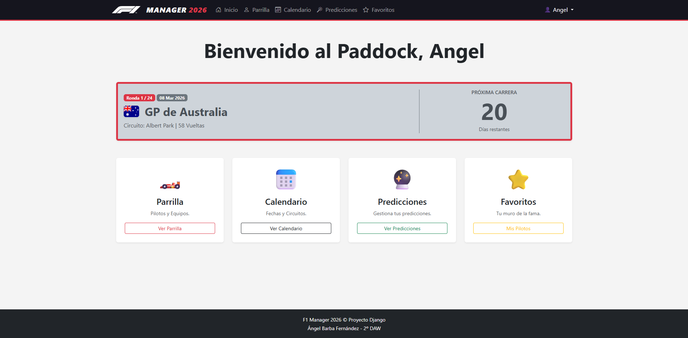
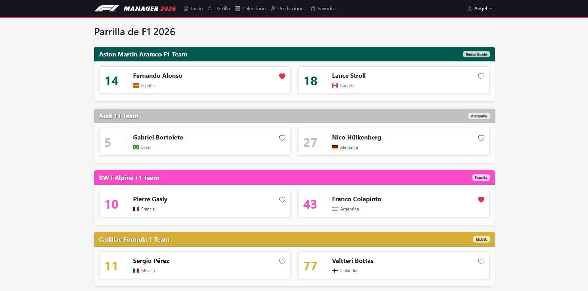
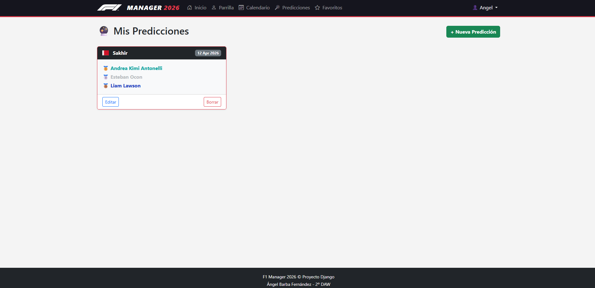
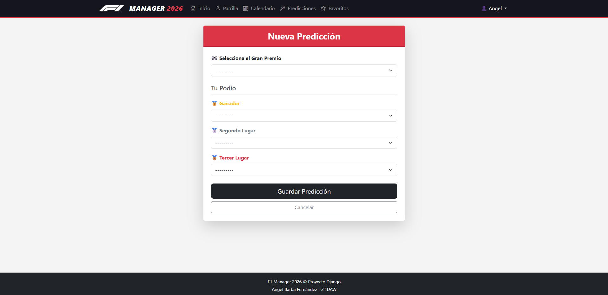
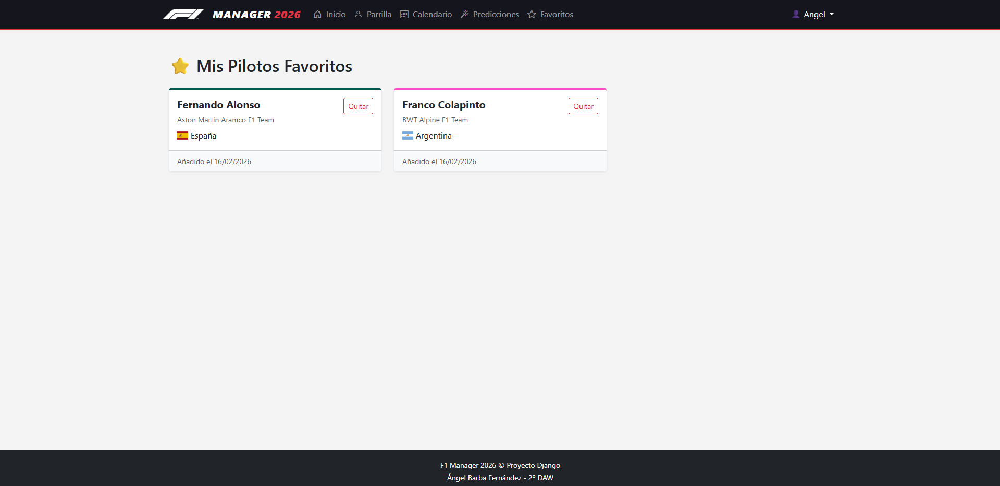

# 🏎️ F1 Manager 2026 - Proyecto Django

Este es un gestor integral de la temporada 2026 de Fórmula 1 desarrollado con Django y Bootstrap. La aplicación permite a los usuarios autenticados gestionar sus pilotos favoritos, realizar predicciones de podio para cada Gran Premio y seguir el calendario oficial con una interfaz moderna y tematizada.

---

## 🚀 Credenciales de Acceso (Demo)

Para probar las funcionalidades de predicciones y favoritos, utiliza estas credenciales:

- **Usuario:** angel  
- **Contraseña:** 1234

---

## 🛠️ Estructura del Proyecto

La arquitectura sigue el patrón **MVT (Model-View-Template)** de Django:

```plaintext
f1manager/
├── core/
│   ├── management/commands/      # Script de carga masiva de datos oficiales
│   ├── templates/core/           # Plantillas HTML (Base, Home, Parrilla, etc.)
│   ├── forms.py                  # Lógica de validación de Predicciones
│   ├── models.py                 # Definición de la Base de Datos (integridad y reglas)
│   ├── views.py                  # Lógica de negocio y control de acceso
│   └── urls.py                   # Enrutamiento de la aplicación
├── static/
│   └── favicon.ico               # Identidad visual en la pestaña del navegador
├── db.sqlite3                    # Base de datos local
└── manage.py                     # Ejecutable principal de Django
```

---

## 📋 Lógica de Negocio e Integridad de Datos

El proyecto implementa reglas estrictas de base de datos para asegurar la veracidad de la información:

- **Protección de Escuderías:** No se puede eliminar una escudería si tiene pilotos asociados (`models.PROTECT`).
- **Unicidad de Pilotos:** Se impide la creación de pilotos con el mismo nombre y número.
- **Restricción de Predicciones:**
  - Un usuario solo puede realizar una predicción por Gran Premio.
  - No se permiten predicciones para carreras cuya fecha ya ha pasado.
  - Validación en formulario para no repetir el mismo piloto en el podio (1º, 2º y 3º).
- **Sistema de Favoritos:** Relación única entre Usuario y Piloto para evitar duplicados en la sección personal.

---

## 📸 Galería del Proyecto

### 🏠 Panel de Control (Home)
El Dashboard principal muestra una cuenta regresiva dinámica hacia el próximo Gran Premio con la bandera del país anfitrión y acceso rápido a todas las secciones.  


### 🏎️ Parrilla de Salida
Listado agrupado por escuderías con sus colores oficiales y banderas ISO. Permite marcar pilotos como favoritos en tiempo real.  


### 📅 Calendario Oficial
Cronograma completo de las 24 carreras de la temporada 2026, destacando estrenos como el Circuito IFEMA Madrid.  


### 🔮 Sistema de Predicciones
Los usuarios pueden intentar adivinar el podio de las próximas carreras. El sistema bloquea automáticamente la edición si la carrera ya ha comenzado.  
`


### ⭐ Mis Favoritos
Sección personalizada donde el usuario gestiona su lista de pilotos preferidos.  


---

## ⚙️ Tecnologías Utilizadas

- **Backend:** Python 3.12 & Django 5.x  
- **Frontend:** HTML5, CSS3, Bootstrap 5.3  
- **Iconografía:** Bootstrap Icons & Flag Icons CSS  
- **Base de Datos:** SQLite3

---

## 👨‍💻 Autor

Desarrollado por **Ángel Barba Fernández** - 2º DAW

